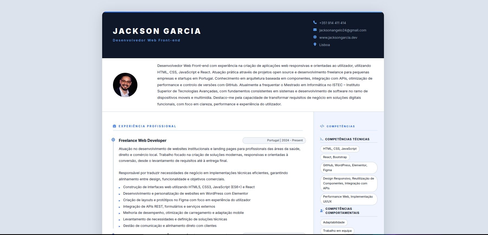

# CV Online — Jackson Garcia

> Currículo online moderno, responsivo e fácil de personalizar.
> Construído com HTML, CSS e Bootstrap 5 — sem frameworks pesados, sem dependências complexas.



---

## Índice

- [Visão Geral](#-visão-geral)
- [Tecnologias](#-tecnologias)
- [Estrutura de Pastas](#-estrutura-de-pastas)
- [Como Executar Localmente](#-como-executar-localmente)
- [Como Personalizar](#-como-personalizar)
  - [Nome e Cargo](#1-nome-e-cargo)
  - [Foto de Perfil](#2-foto-de-perfil)
  - [Contactos](#3-contactos)
  - [Bio / Apresentação](#4-bio--apresentação)
  - [Experiências](#5-experiências)
  - [Skills](#6-skills)
  - [Formação e Certificações](#7-formação-e-certificações)
  - [Redes Sociais](#8-redes-sociais)
  - [Cores e Estilos](#9-cores-e-estilos)
  - [Ícones](#10-ícones)
  - [Projetos (seção desativada)](#11-projetos-seção-desativada)
- [Download em PDF](#-download-em-pdf)
- [Como Fazer Deploy](#-como-fazer-deploy)
- [Contribuição](#-contribuição)
- [Licença](#-licença)

---

## Visão Geral

Este projeto é um **currículo online de página única** pensado para desenvolvedores front-end que querem uma presença profissional na web sem depender de plataformas externas como LinkedIn ou Notion.

**Destaques:**
- Design premium com paleta Slate Navy + Electric Blue
- Layout responsivo — funciona em desktop, tablet e mobile
- Botão "Download PDF" integrado via `window.print()`
- Código limpo, comentado e fácil de adaptar
- Zero JavaScript complexo — apenas Bootstrap para o grid

---

## Tecnologias

| Tecnologia | Versão | Função |
|---|---|---|
| HTML5 | — | Estrutura e semântica |
| CSS3 | — | Estilo, layout e responsividade |
| Bootstrap | 5.3.2 | Grid responsivo (via CDN) |
| Font Awesome | 6.5.1 | Ícones (via CDN) |
| Google Fonts | — | Tipografia Inter (via CDN) |

> Nenhuma instalação de dependências é necessária. Tudo é carregado via CDN.

---

## Estrutura de Pastas

```
resume-jackson/
│
├── index.html              ← Estrutura e conteúdo do CV
│
├── assets/
│   ├── css/
│   │   └── style.css       ← Todos os estilos visuais
│   │
│   └── images/
│       ├── resume-profile.webp   ← Foto de perfil (intro do CV)
│       ├── profile.webp          ← Favicon da aba do browser
│       └── projetoCV.png         ← Preview para o README
│
└── README.md
```

---

## Como Executar Localmente

Não é necessário instalar nada. Basta:

**Opção 1 — Abrir diretamente no browser:**
```bash
# Clone o repositório
git clone https://github.com/jacksonangelo/resume-jackson.git

# Entre na pasta
cd resume-jackson

# Abra o ficheiro no browser
open index.html        # macOS
xdg-open index.html    # Linux
start index.html       # Windows
```

**Opção 2 — Com Live Server (VS Code):**
1. Instale a extensão [Live Server](https://marketplace.visualstudio.com/items?itemName=ritwickdey.LiveServer)
2. Clique com o botão direito no `index.html`
3. Selecione **"Open with Live Server"**

---

## Como Personalizar

Todos os comentários do código estão em português e indicam exatamente **onde alterar cada informação**. Abaixo, um guia rápido:

---

### 1. Nome e Cargo

**Ficheiro:** `index.html`

```html
<!-- Procure por .resume-name e .resume-tagline -->
<h2 class="resume-name mb-0 text-uppercase">Seu Nome Aqui</h2>
<div class="resume-tagline mb-3 mb-md-0">Seu Cargo / Especialidade</div>
```

Também atualize o `<title>` e a `<meta name="author">` no `<head>`.

---

### 2. Foto de Perfil

**Ficheiro:** `index.html`

```html

```

**Dicas:**
- Coloque a sua foto em `assets/images/`
- Formatos recomendados: `.webp` (menor tamanho), `.jpg` ou `.png`
- Tamanho ideal: mínimo 200×200px, proporção quadrada
- Para o favicon: troque `assets/images/profile.webp` no `<link rel="icon">`

Para ajustar o arredondamento da foto, edite em `style.css`:
```css
.resume-profile-image {
  border-radius: 14px;  /* 50% = circular | 0 = quadrado | 14px = arredondado */
}
```

---

### 3. Contactos

**Ficheiro:** `index.html` — dentro de `.resume-contact`

```html
<!-- Telefone -->
<a class="resume-link" href="tel:+351XXXXXXXXX">+351 XXX XXX XXX</a>

<!-- E-mail -->
<a class="resume-link" href="mailto:seuemail@exemplo.com">seuemail@exemplo.com</a>

<!-- Website / Portfólio -->
<a class="resume-link" href="https://seusite.com" target="_blank">www.seusite.com</a>

<!-- Cidade (texto simples) -->
<i class="fas fa-map-marker-alt icon"></i>Sua Cidade
```

---

### 4. Bio / Apresentação

**Ficheiro:** `index.html` — dentro de `.resume-intro`

```html
<p class="mb-0">Escreva aqui o seu parágrafo de apresentação.
Recomendado: 4 a 6 linhas, focado em experiência, tecnologias e diferenciais.</p>
```

---

### 5. Experiências

**Ficheiro:** `index.html` — dentro de `<section class="work-section">`

**Para adicionar uma nova experiência**, copie o bloco abaixo e cole após o último `<!--//item-->`:

```html
<div class="item mb-3">
  <div class="item-heading row align-items-center mb-2">
    <!-- Cargo / Título -->
    <h4 class="item-title col-12 col-md-6 col-lg-8 mb-2 mb-md-0">
      Seu Cargo — Empresa
    </h4>
    <!-- Local e Período -->
    <div class="item-meta col-12 col-md-6 col-lg-4 text-muted text-start text-md-end">
      País | Ano - Ano
    </div>
  </div>
  <div class="item-content">
    <!-- Descrição em parágrafo -->
    <p>Descrição das suas responsabilidades e conquistas nesta posição.</p>
    <!-- Lista de bullets -->
    <ul class="resume-list">
      <li>Responsabilidade ou conquista 1</li>
      <li>Responsabilidade ou conquista 2</li>
    </ul>
  </div>
</div><!--//item-->
```

**Para remover** uma experiência, apague o bloco completo entre `<div class="item">` e `</div><!--//item-->`.

---

### 6. Skills

**Ficheiro:** `index.html` — dentro de `<section class="skills-section">`

```html
<!-- Adicione ou remova <li> conforme necessário -->
<ul class="list-unstyled resume-skills-list">
  <li class="mb-2">Nova Tecnologia</li>
  <li class="mb-2">Outro Framework</li>
</ul>
```

Cada `<li>` vira automaticamente uma **tag/chip interativa** com hover azul.

---

### 7. Formação e Certificações

**Ficheiro:** `index.html`

**Formação — adicionar item:**
```html
<li class="mb-3">
  <div class="resume-degree font-weight-bold">Nome do Curso</div>
  <div class="resume-degree-org text-muted">Nome da Instituição</div>
  <div class="resume-degree-time text-muted">Ano Início - Ano Fim</div>
</li>
```

**Certificação — adicionar item:**
```html
<li class="mb-3">
  <div class="font-weight-bold">Nome do Certificado</div>
  <div class="text-muted">Emissor · Ano</div>
</li>
```

---

### 8. Redes Sociais

**Ficheiro:** `index.html` — dentro de `.resume-footer`

```html
<li class="list-inline-item mb-lg-0 me-3">
  <a class="resume-link" href="https://github.com/seu-usuario" target="_blank" rel="noopener noreferrer">
    <i class="fa-brands fa-github-square fa-2x me-2"></i>
    <span class="d-none d-lg-inline-block text-muted">github.com/seu-usuario</span>
  </a>
</li>
```

**Ícones de redes disponíveis no Font Awesome:**
| Rede | Classe do ícone |
|---|---|
| GitHub | `fa-brands fa-github-square` |
| LinkedIn | `fa-brands fa-linkedin` |
| X / Twitter | `fa-brands fa-square-x-twitter` |
| Instagram | `fa-brands fa-instagram` |
| YouTube | `fa-brands fa-youtube` |
| Dev.to | `fa-brands fa-dev` |

---

### 9. Cores e Estilos

**Ficheiro:** `assets/css/style.css` — seção `:root`

Todas as cores estão em variáveis CSS. Troque os valores hexadecimais para mudar toda a paleta:

```css
:root {
  --primary:       #2563EB;  /* cor principal (botões, links, destaques) */
  --primary-dark:  #1D4ED8;  /* hover de botões */
  --primary-light: #DBEAFE;  /* bordas e fundos sutis */
  --accent:        #60A5FA;  /* textos sobre fundo escuro */
  --dark:          #0F172A;  /* header, footer, títulos */
  --body:          #1E293B;  /* texto principal */
  --muted:         #64748B;  /* datas, textos secundários */
  --aside-bg:      #F0F4FF;  /* fundo da barra lateral */
  --page-bg:       #DDE3EE;  /* fundo da página */
}
```

**Exemplos de paletas alternativas:**

```css
/* Verde / Esmeralda */
--primary: #059669; --accent: #34D399; --dark: #064E3B;

/* Roxo / Violeta */
--primary: #7C3AED; --accent: #A78BFA; --dark: #1E1B4B;

/* Laranja / Amber */
--primary: #D97706; --accent: #FCD34D; --dark: #1C1917;
```

> Dica: use [coolors.co](https://coolors.co) para gerar paletas harmónicas.

---

### 10. Ícones

Todos os ícones usam **Font Awesome 6**. Para trocar um ícone:

1. Aceda a [fontawesome.com/icons](https://fontawesome.com/icons)
2. Pesquise o ícone desejado
3. Copie a classe (ex: `fa-solid fa-rocket`)
4. Substitua no HTML:

```html
<!-- Antes -->
<i class="fas fa-briefcase"></i>

<!-- Depois -->
<i class="fas fa-rocket"></i>
```

---

### 11. Projetos (seção desativada)

Há uma **seção de projetos já estruturada** no `index.html`, apenas comentada. Para ativá-la:

Localize o comentário `<!-- SEÇÃO DE PROJETOS (DESATIVADA) -->` no HTML e remova os delimitadores de comentário `<!--` e `-->` que envolvem o bloco da `<section class="project-section">`.

---

## Download em PDF

O botão **"Download PDF"** no rodapé usa `window.print()` do browser.

- Não é necessário nenhum ficheiro PDF externo
- O browser abre o diálogo de impressão → escolha **"Guardar como PDF"**
- O botão é automaticamente ocultado no PDF gerado via `@media print`

**Para imprimir bem:**
> No diálogo de impressão, defina margens como "Nenhuma" ou "Mínimas" e ative "Gráficos de fundo" para preservar as cores.

---

## Como Fazer Deploy

### GitHub Pages (gratuito e recomendado)

```bash
# 1. Crie um repositório no GitHub com o nome:
#    seu-usuario.github.io  (para URL limpa)
#    ou qualquer outro nome (URL ficará: seu-usuario.github.io/nome-repo)

# 2. Faça push do projeto
git init
git add .
git commit -m "Initial commit"
git branch -M main
git remote add origin https://github.com/seu-usuario/seu-repo.git
git push -u origin main

# 3. Nas configurações do repositório:
#    Settings → Pages → Source: "Deploy from branch" → Branch: main → / (root)
```

O CV ficará disponível em: `https://seu-usuario.github.io/nome-repo`

### Outras opções gratuitas

| Plataforma | Como fazer deploy |
|---|---|
| **Netlify** | Arraste a pasta do projeto para [app.netlify.com/drop](https://app.netlify.com/drop) |
| **Vercel** | Importe o repositório GitHub em [vercel.com](https://vercel.com) |
| **Cloudflare Pages** | Conecte o repo em [pages.cloudflare.com](https://pages.cloudflare.com) |

---

## Contribuição

Contribuições são bem-vindas! Se encontrou um bug, tem uma sugestão de melhoria ou quer adicionar uma funcionalidade:

1. Faça um **fork** do repositório
2. Crie uma branch: `git checkout -b feature/minha-melhoria`
3. Faça commit das alterações: `git commit -m "feat: descrição da melhoria"`
4. Envie para o seu fork: `git push origin feature/minha-melhoria`
5. Abra um **Pull Request**

---

## Licença

Este projeto está sob a licença **MIT** — pode ser usado, modificado e distribuído livremente, inclusive para fins comerciais.

Feito com foco em qualidade, performance e reutilização.

---

> Desenvolvido por [Jackson Garcia](https://github.com/jacksonangelo) · [www.jacksongarcia.dev](http://www.jacksongarcia.dev)
